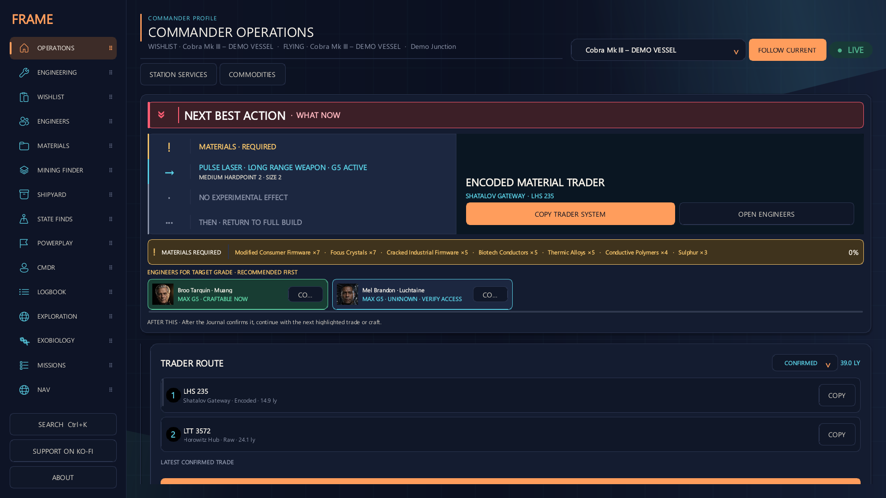

<div align="center">

# ED-Frame

**Your Commander. Your ships. Your next move.**

A free, open-source Windows companion for Elite Dangerous. Engineering, mining, Powerplay and exploration — connected to your local Journal and our own community server.

[](https://github.com/CMDRForcer/ED-Frame/releases/latest) [](https://github.com/CMDRForcer/ED-Frame/actions/workflows/quality.yml) [](#get-started) [](LICENSE)

[**Download for Windows**](https://github.com/CMDRForcer/ED-Frame/releases/latest) · [English guide](docs/ED-Frame-1.0-Guide-EN.md) · [Deutsche Anleitung](docs/ED-Frame-1.0-Guide-DE.md) · [Report a bug](https://github.com/CMDRForcer/ED-Frame/issues)

**App 1.0.8** · **Live catalog server 0.9.4** · **EN / DE / ES / FR** · **Six themes**

</div>



*Current interface with synthetic demo data · Orbital Dawn theme.*

## Get started

1. Open the [latest release](https://github.com/CMDRForcer/ED-Frame/releases/latest) and download `ED-Frame-<version>-Windows.zip`.
2. Extract the **entire ZIP** into a writable folder. When upgrading, first quit the old app, including its tray process.
3. Start `ED-Frame.exe` with the `_internal` folder beside it. **Python is bundled.**
4. Select your Elite Dangerous Journal folder if needed, then review **Connections**.

Existing profiles, builds and retained data are reused. Full project source and `SHA256SUMS.txt` are available as separate release downloads.

## One workspace for your Commander

ED-Frame follows your actual ships and physical module slots. Plan a parked ship, track its missing materials and let Journal-confirmed crafts advance the build. Operations brings the next collection, trade, unlock or travel step into one view.

| Feature | What you can do |
| --- | --- |
| **Operations** | Follow the next action for your selected build, with material readiness and routes. |
| **Engineering** | Plan grades, experimental effects and module swaps on real ship slots; import or export builds. |
| **Wishlist** | Track multiple fleet builds, missing materials and confirmed crafting progress. |
| **Engineers** | Search capabilities, follow unlock prerequisites and find suitable destinations. |
| **Technology Brokers** | Track one-time Human and Guardian unlock requirements. |
| **Materials** | Review inventory, farming guidance and trades that protect materials reserved for builds. |
| **Mining Finder** | Compare sites, methods, yields, prices, demand and distance; plan profit or Powerplay routes. |
| **Measured mining yield** | Distinguish observed Prospector/refining samples from hotspot and ring-type estimates. |
| **Module & Ship Finder** | Search observed inventories and prices; check module fit for your ship and slot. |
| **Commodity Finder** | Find buying stock or selling demand with quantity, quote-age and landing-pad filters. |
| **Station services** | Find nearby stations offering the services you need. |
| **State Finds & HGE** | Compare signal sightings, reported lifetimes and separately labelled BGS predictions. |
| **Powerplay** | Follow pledge, rank and merits; plan Acquire, Reinforce and Undermine with dated evidence. |
| **CMDR & Fleet** | Review ranks, reputation, credits, assets, CR/h and the location of known ships. |
| **Missions** | Track deadlines, massacre stacks and recorded Community Goals. |
| **Exploration** | Review unsold scans, noteworthy bodies and estimated cartography values. |
| **Exobiology** | Follow survey targets, sampling distances, completed species and observed earnings. |
| **Surface navigation** | Save planetary waypoints and follow a compass in the app or a separate overlay. |
| **Logbook** | Search flight events, session activity and local notes. |
| **Appearance & connections** | Choose six themes and four languages; manage profiles, overlays and data sources. |

## What's new

**App 1.0.8**

- More mining results: grouped system/commodity lookups recover suitable markets and rings missed by regional top lists.
- Powerplay searches filter by the selected Power and goal. Observations up to 48 hours old are current; eligible older observations up to 14 days appear as **last known / check in game**.
- Heavy Mining, Journal and Powerplay work uses bounded background processes that adapt concurrency to available CPU and memory. Polling and notifications are batched.

**Live server 0.9.4**

- Shared statistics refresh in the background approximately every five minutes; Collector status stays live.
- Statistics requests measured **0.06–0.18 seconds**, compared with a previous single request of about 42 seconds. Existing 1.0.8 installations benefit without an app update.

[1.0.8 release notes](docs/releases/1.0.8.md) · [Changelog](CHANGELOG.md) · [Server measurements](reports/server_status_cache_2026-10-10.md)

## Powered by our own community server

The **ED-Frame catalog server** collects supported public EDDN observations and supplies markets, systems, stations, mining evidence, Powerplay facts, module and ship offers, and State Finds data. Targeted public Spansh snapshots can supplement missing Powerplay control.

The app combines these shared facts with your local Journal and retained observations. Prices, demand and Powerplay data keep their **original source dates**. Missing data and last-known proposals stay visible; observations are not guaranteed stock, yields or merit payouts. Large cold searches can still take time.

Already retained observations remain available offline. See the [server documentation](server/catalog_service/README.md) for the data contract and hosting details.

## Your data and connections

**Your Commander profile stays local.** Ships, plans, wishlists, Journal files and service credentials are stored outside the program folder.

- **ED-Frame and EDDN** community connections are enabled for new profiles and have separate controls in **Connections**. Disabling them preserves retained local data.
- The **ED-Frame server** accepts supported anonymous public observations, not Commander names/FIDs, raw Journals, private builds or credentials.
- **Frontier CAPI and INARA** require separate setup. INARA can send supported Commander events when enabled; review each service for local-only operation. Supported credentials are protected with Windows DPAPI.

[English privacy and connection guide](docs/ED-Frame-1.0-Guide-EN.md#connections-and-privacy) · [Deutsche Anleitung](docs/ED-Frame-1.0-Guide-DE.md)

<details>
<summary><strong>Run from source</strong></summary>

Install Python 3.13, clone this repository, then run:

```text
INSTALL_REQUIREMENTS.bat
START_APP.bat
```

Dependencies are listed in [requirements.txt](requirements.txt). Source checkouts identify themselves as development builds to external integrations. Automated checks cover application contracts, repository hygiene and the real QML interface.

</details>

## Help and project

[Guides](docs/ED-Frame-1.0-Guide-EN.md) · [Website](https://cmdrforcer.github.io/) · [Issues & suggestions](https://github.com/CMDRForcer/ED-Frame/issues) · [License](LICENSE)

The current 1.0 release line succeeds the earlier EDEC/ED-Frame builds, including 1.5.43. Use **Latest release** rather than sorting historical tags by number. Older PDF manuals are historical references.

ED-Frame is free under **GPL-3.0** and is an independent project, unaffiliated with Frontier Developments. Elite Dangerous is a trademark of Frontier Developments plc.

Exobiology reference files express public game facts; colony-range distances are attributed to the [Elite Dangerous Fandom wiki](https://elite-dangerous.fandom.com/wiki/Exobiology_Sample_Values_and_Details) (CC BY-SA).
