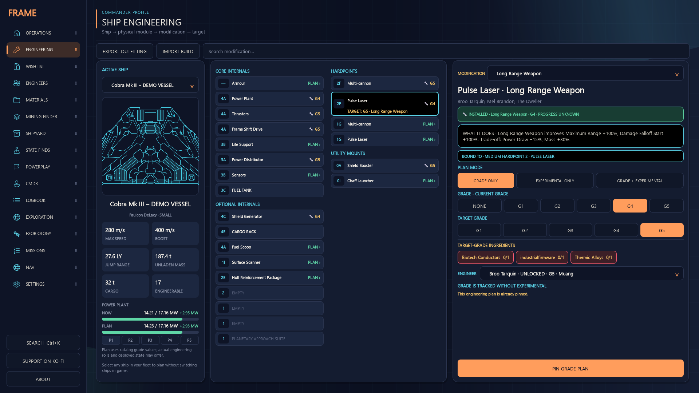
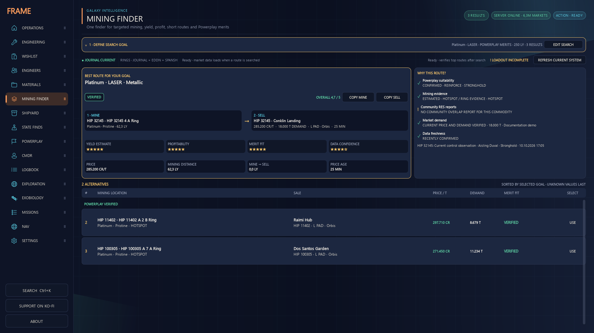
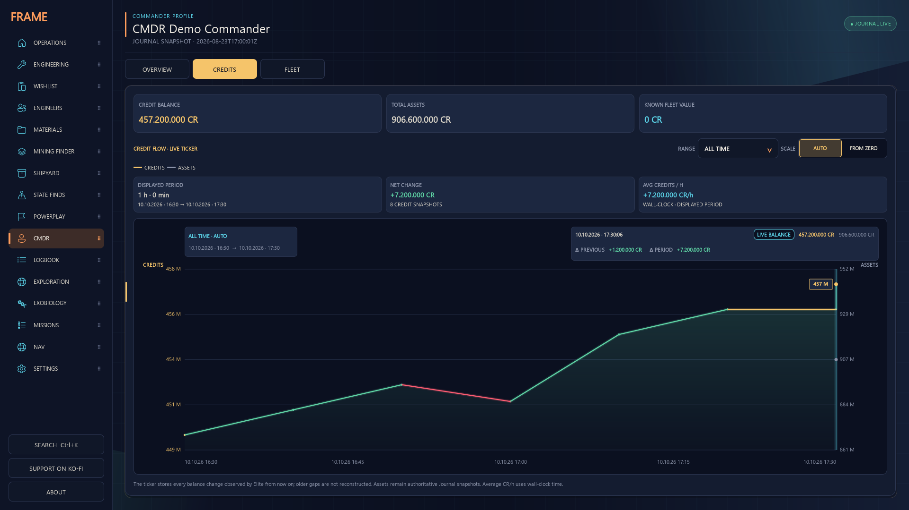
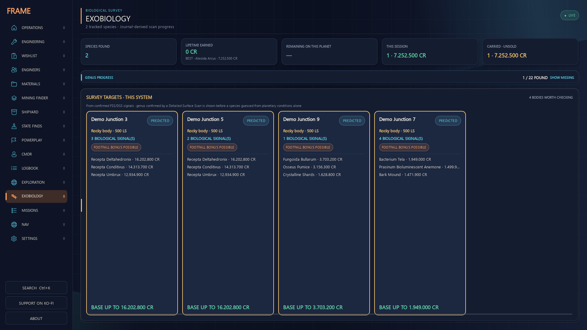
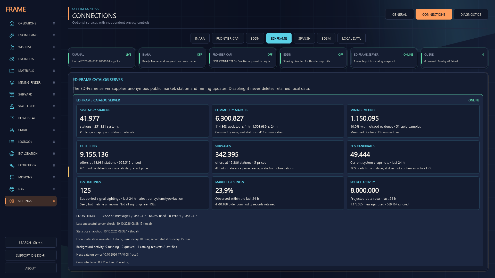
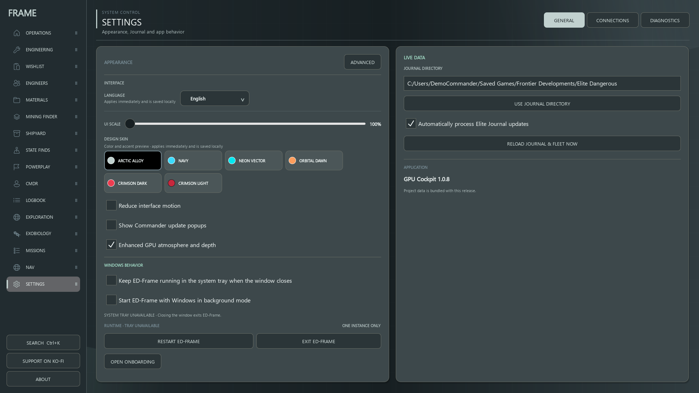

<div align="center">

# ED-Frame

### Your Commander. Your ships. Your next move.

**Build the ship you want. Find your next mining run. Make every discovery count.**

A free, open-source Windows companion for **Elite Dangerous**, bringing your local Journal, fleet plans and community data into one cockpit — backed by our own ED-Frame server.

[](https://github.com/CMDRForcer/ED-Frame/releases/latest) [](https://github.com/CMDRForcer/ED-Frame/actions/workflows/quality.yml) [](#get-started) [](LICENSE)

[**Download for Windows**](https://github.com/CMDRForcer/ED-Frame/releases/latest) · [English guide](docs/ED-Frame-1.0-Guide-EN.md) · [Deutsche Anleitung](docs/ED-Frame-1.0-Guide-DE.md)

**App 1.0.8** · **Own community server** · **EN / DE / ES / FR** · **Six themes**

</div>


*Operations brings your selected build, material readiness and next destinations together · demo profile.*

## Start with a goal. Leave with a plan.

Maybe tonight is for finishing that G5 upgrade. Maybe it's a profitable mining trip, another Powerplay rank or a detour to an interesting planet. ED-Frame helps connect **what you want to do** with **what your Commander already has**.

It follows your actual ships and module slots, remembers your plans between sessions and draws on shared public observations. Your next useful action is easier to find — whether you're outfitting in the Bubble or heading out to explore.

| Build your fleet | Find your next run | Follow your discoveries |
| :---: | :---: | :---: |
| [Engineering & materials](#build-the-ship-you-want-to-fly) | [Mining & Powerplay](#find-your-next-mining-run) | [Exploration & exobiology](#turn-biological-signals-into-a-landing-plan) |

*Screenshots show the current app with a synthetic Commander profile and example observations. Prices, routes and server counters illustrate the interface; they are not live recommendations.*

## Build the ship you want to fly

**From an installed module to a finished build.** Choose a ship from your fleet, select its physical slot and plan the next grade, experimental effect or module replacement. You can work on a parked ship while flying something else.



- **Engineering** shows installed modifications beside your target, with ingredients and suitable engineers.
- **Wishlist** keeps multiple fleet builds together and follows Journal-confirmed crafting progress.
- **Materials** reveals what's missing and suggests collection or trading options while protecting materials reserved for your builds.
- **Engineers & Technology Brokers** help you follow unlock requirements and find the right destination.

Pin the plan and return to **Operations** for the next collection, trade, unlock or travel step. Build import and export help you keep your ideas moving between tools.

## Find your next mining run

**Pick the goal, then compare the whole trip.** Search for a commodity or browse all commodities, choose your mining method and prioritize profit, yield, distance or Powerplay merits.



The recommended route puts the **mining site and sale destination side by side**. Alternatives show price, demand and suitability, while “Why this route?” explains the evidence behind the choice.

- Compare ring types, hotspot evidence, measured yield samples and travel distance.
- Filter markets by demand, landing-pad size and observation age.
- Plan **Acquire, Reinforce or Undermine** for your selected Power, with dated control evidence.
- Check your ship's mining loadout and copy the mining or sale destination directly.

Current facts, last-known suggestions and missing evidence remain distinguishable. Observed yield samples help you compare sites; they don't promise a particular haul or merit payout.

## See what your sessions are earning

**Your progress deserves more than a single balance.** The Commander workspace brings ranks, reputation, credits and known fleet information together. The credit ticker turns recorded balance changes into a visible history.



Switch between time ranges, inspect the net change and average **CR/h**, or review your fleet and known ship locations. Credit and asset values retain their sources; gaps in the history remain gaps.

**Missions** adds deadlines, massacre stacks and recorded Community Goals. **Logbook** keeps flight events, session activity and your local notes within reach.

## Turn biological signals into a landing plan

**Find a reason to land — and keep track once you're there.** Exobiology combines detected biological signals with planetary conditions and your recorded samples, helping you spot worthwhile survey targets in the current system.



- Review candidate species and their reference values, with predictions labelled as predictions.
- Follow your sampling progress and distance to the next sample when position data is available.
- Keep this session's discoveries, completed species and carried unsold samples in view.
- Track genus progress and observed earnings from completed sales.

The **Exploration** workspace also follows unsold scans, noteworthy bodies and estimated cartography values. **Surface navigation** lets you save planetary waypoints and follow a compass in the app or a separate overlay.

## A community server behind your cockpit

**ED-Frame has its own live catalog service.** Our server collects supported public EDDN observations and supplies shared market, station, mining, Powerplay and signal information to the app. Your local Journal adds the facts about your own Commander.



Open **Connections → ED-Frame** to see what the catalog contains: systems and stations, commodity markets, mining evidence, module and ship offers, signal sightings, freshness and data coverage. Expand the details for local synchronization and background activity.

That shared data also powers **Module & Ship Finder**, **Commodity Finder**, nearby **station services** and **State Finds & HGE**. Find the module, buying stock, selling demand or station service you need; signal sightings and BGS predictions are labelled separately.

The app combines the server with retained local observations and supported Spansh/EDSM sources. Already retained data remains available offline. Source dates stay attached to prices and Powerplay facts, so you can judge how current a result is.

## Make the cockpit yours

Choose **six themes** and **four interface languages**: English, German, Spanish and French. Adjust the UI scale, reduce motion, arrange the sidebar and choose the connections that fit how you play.



Dark and light options include **Orbital Dawn, Navy, Neon Vector, Arctic Alloy, Crimson Dark and Crimson Light**. Profiles, overlays and Windows tray behavior can be configured from the same workspace.

Heavy Mining, Journal and Powerplay work runs in bounded background processes, with concurrency adapted to available CPU and memory. Updates and notifications are grouped; large initial searches can still take time.

## Get started

1. Open the [latest release](https://github.com/CMDRForcer/ED-Frame/releases/latest) and download `ED-Frame-<version>-Windows.zip`.
2. Extract the **entire ZIP** into a writable folder. When upgrading, quit the old app, including its tray process.
3. Start `ED-Frame.exe` with the `_internal` folder beside it. **Python is bundled.**
4. Select your Elite Dangerous Journal folder if needed, then review **Connections**.

Existing profiles, builds and retained data are reused. Full project source and `SHA256SUMS.txt` are separate release downloads. The current **1.0 release line** succeeds earlier EDEC/ED-Frame builds, including 1.5.43; use the **Latest release** link to find the current version.

## Your profile, your connections

Your Commander profile, ships, plans, wishlists, Journal files and service credentials are **stored locally**, outside the program folder.

- **ED-Frame and EDDN** community connections are enabled for new profiles and have separate controls. Disabling them preserves retained local data.
- The **ED-Frame server** accepts supported anonymous public observations, not Commander names/FIDs, raw Journals, private builds or credentials.
- **Frontier CAPI and INARA** require separate setup. INARA can send supported Commander events when enabled; review each service for local-only operation. Supported credentials are protected with Windows DPAPI.

[Connection and privacy guide](docs/ED-Frame-1.0-Guide-EN.md#connections-and-privacy) · [Deutsche Anleitung](docs/ED-Frame-1.0-Guide-DE.md)

<details>
<summary><strong>Latest improvements — app 1.0.8 and server 0.9.4</strong></summary>

- Broader mining coverage through grouped system/commodity lookups.
- Powerplay searches filter by the selected Power and goal. Observations up to 48 hours old are current; eligible older observations up to 14 days appear as **last known / check in game**.
- Bounded background processing and grouped updates reduce competing work.
- Server statistics refresh in the background approximately every five minutes. Warm statistics requests measured **0.06–0.18 seconds**, compared with a previous single request of about 42 seconds; existing 1.0.8 installations benefit immediately.

[Release notes](docs/releases/1.0.8.md) · [Changelog](CHANGELOG.md) · [Server documentation](server/catalog_service/README.md) · [Server measurements](reports/server_status_cache_2026-10-10.md)

</details>

<details>
<summary><strong>Run from source</strong></summary>

Install Python 3.13, clone this repository, then run:

```text
INSTALL_REQUIREMENTS.bat
START_APP.bat
```

See [requirements.txt](requirements.txt) for dependencies. Source checkouts identify themselves as development builds to external integrations. Automated checks cover application contracts, repository hygiene and the real QML interface.

</details>

## Fly with us

ED-Frame grows with Commander feedback. Try it on your next session, tell us what helped and [share a bug or feature idea](https://github.com/CMDRForcer/ED-Frame/issues). If you enjoy the project, a GitHub star helps other Commanders find it.

**[Download ED-Frame](https://github.com/CMDRForcer/ED-Frame/releases/latest)** · [Read the guide](docs/ED-Frame-1.0-Guide-EN.md) · [Visit the website](https://cmdrforcer.github.io/)

---

Free under **[GPL-3.0](LICENSE)**. An independent community project, unaffiliated with Frontier Developments. Elite Dangerous is a trademark of Frontier Developments plc.

Exobiology reference files express public game facts; colony-range distances are attributed to the [Elite Dangerous Fandom wiki](https://elite-dangerous.fandom.com/wiki/Exobiology_Sample_Values_and_Details) (CC BY-SA). Older PDF manuals are historical references.
